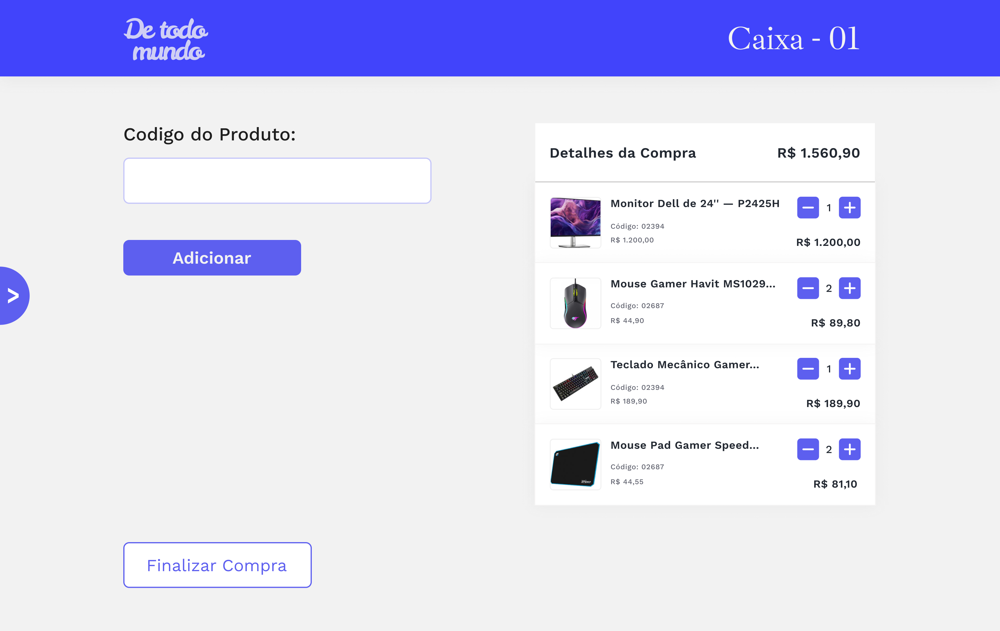

<h1 align="center"> VM Softwares - POS - Backend </h1>

O sistema de controle de fluxo para a empresa VM Softwares, desenvolvido com Fastify e Node.js, tem como objetivo otimizar a gestão de vendas e operações da empresa. 

  <a href="#🚀-tecnologias">Tecnologias</a>&nbsp;&nbsp;&nbsp;|&nbsp;&nbsp;&nbsp;
  <a href="#💻-projeto">Projeto</a>&nbsp;&nbsp;&nbsp;|&nbsp;&nbsp;&nbsp;
  <a href="#🚧-em-construção">Em Construção</a>&nbsp;&nbsp;&nbsp;|&nbsp;&nbsp;&nbsp;
  <a href="#👨‍💻-contribuidores">Contribuidores</a>&nbsp;&nbsp;&nbsp;|&nbsp;&nbsp;&nbsp;
  <a href="#📞-contato">Contato</a>

  

 

## 🚀 Tecnologias

Esse projeto foi desenvolvido com as seguintes tecnologias:

- Node.js
- Fastify
- PostgreSQL
- Neon Database
- CRUD
- HTTP
- API RESTful

## 💻 Projeto

Ele permite o cadastro, edição e remoção de produtos, além de realizar o controle de estoque de forma automática conforme as vendas são registradas. A plataforma oferece funcionalidades para acompanhar pedidos, registrar pagamentos e gerar relatórios financeiros sobre vendas e produtos mais vendidos. Utilizando o PostgreSQL como banco de dados, o sistema adota uma arquitetura baseada em API RESTful, proporcionando uma solução eficiente e moderna para a administração de negócios.

### 🚧 Em construção

#### 👤 Rotas Clientes
- [x] Mostrar todos os clientes *GET /client/all*
- [x] Mostrar um cliente *GET /client/:id*
- [x] Novo cliente *POST /client/add*
- [x] Alterar informação (nome, telefone/email) *PUT /client/:id*
- [x] Deletar Cliente *DELETE /client/:id*

#### 📖 Rotas Catalogos
- [x] Mostrar todos os produtos *GET /product/all*
- [x] Mostrar um produto *GET /product/:id*
- [x] Adicionar produto *POST /product/add*
- [x] Alterar produto (nome, preço, estoque) *PUT /product/:id*
- [x] Deletar produto *DELETE /product/:id*

#### 🛒 Rotas Compras
- [x] Mostrar todas as compras *GET /purchase/log*
- [x] Pagamentos (ao efetuar pagamento, adicionar no log de compras e mostrar nota fiscal) *POST /purchase/add*
- [x] Deletar log (caso queira devolver algum item com nota fiscal) *DELETE /purchase/:id*

## 👨‍💻 Contribuidores

 

   <a href="https://github.com/PedroCabs" target="_blank"> Pedro Cabral (Front-end)</a> 

 

   <a href="https://github.com/danrod278" target="_blank"> Daniel Rodrigues (Back-end)</a> 

 

   <a href="https://github.com/matheusfdosan" target="_blank"> Matheus Faustino (Front-end & Back-end)</a> 

## 📞 Contato

- Acesse também meus outros repositórios no [Github](https://github.com/matheusfdosan?tab=repositories).

- Também me siga no [Instagram](https://instagram.com/matheusfdosan).

- Conecte-se comingo no [Linkedin](https://www.linkedin.com/in/matheusfaus/)
