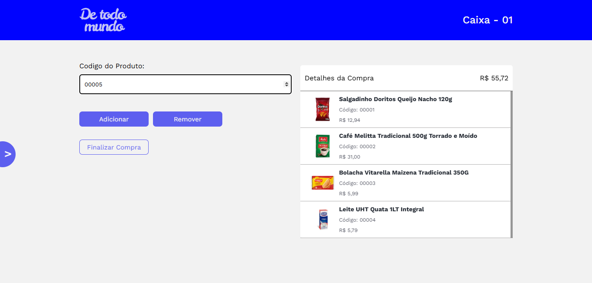

<h1 align="center"> VM Softwares - POS - Backend </h1>

O sistema de controle de fluxo para a empresa VM Softwares, desenvolvido com Fastify e Node.js, tem como objetivo otimizar a gestão de vendas e operações da empresa. 

  <a href="#🚀-tecnologias">Tecnologias</a>&nbsp;&nbsp;&nbsp;|&nbsp;&nbsp;&nbsp;
  <a href="#💻-projeto">Projeto</a>&nbsp;&nbsp;&nbsp;|&nbsp;&nbsp;&nbsp;
  <a href="#🚧-em-construção">Em Construção</a>&nbsp;&nbsp;&nbsp;|&nbsp;&nbsp;&nbsp;
  <a href="#👨‍💻-contribuidores">Contribuidores</a>&nbsp;&nbsp;&nbsp;|&nbsp;&nbsp;&nbsp;
  <a href="#📞-contato">Contato</a>

  

 

## 🚀 Tecnologias

Esse projeto foi desenvolvido com as seguintes tecnologias:

- React.js
- Vite
- Dotenv
- axios
- jspdf

## 💻 Projeto

O projeto é uma aplicação de ponto de venda (POS) desenvolvida em React com Vite como bundler. Ele oferece uma interface para gerenciar produtos, clientes e compras, consumindo uma API RESTful. Inclui funcionalidades como adicionar/remover produtos, gerar PDFs (notas fiscais) com jsPDF. A estrutura utiliza componentes React, estados com useState, e variáveis de ambiente via .env para configurações como a URL da API. É um sistema funcional para controle de vendas.

## 👨‍💻 Contribuidores

 

   <a href="https://github.com/PedroCabs" target="_blank"> Pedro Cabral (Front-end)</a> 

 

   <a href="https://github.com/danrod278" target="_blank"> Daniel Rodrigues (Back-end)</a> 

 

   <a href="https://github.com/matheusfdosan" target="_blank"> Matheus Faustino (Front-end & Back-end)</a> 

## 📞 Contato

- Acesse também meus outros repositórios no [Github](https://github.com/matheusfdosan?tab=repositories).

- Também me siga no [Instagram](https://instagram.com/matheusfdosan).

- Conecte-se comingo no [Linkedin](https://www.linkedin.com/in/matheusfaus/)
